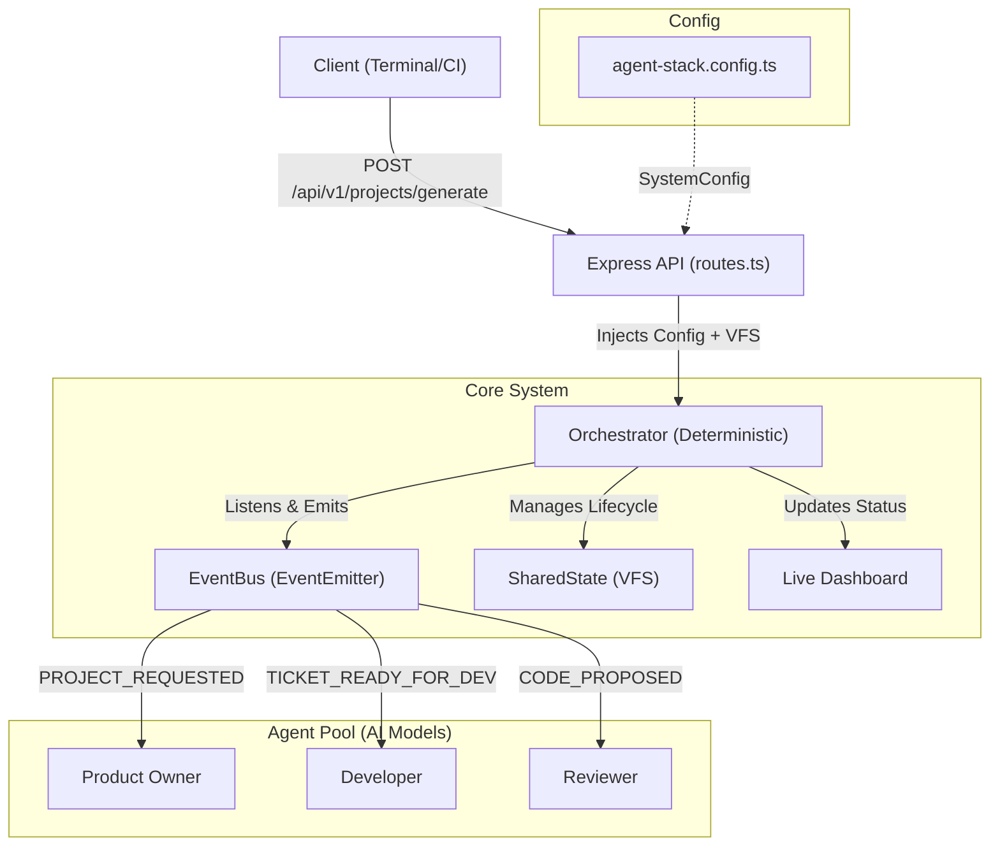
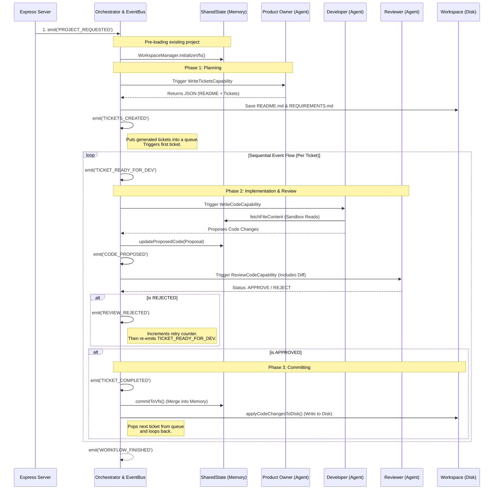
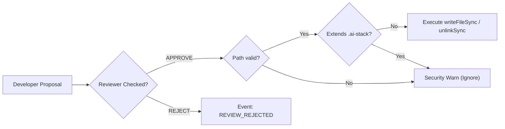

# 🤖 How It Works: The Multi-Agent Stack

This document describes the complete lifecycle of a feature request within the **AI Multi-Agent Stack**. It illustrates the control flow from the initial API request, over the internal event-driven routing to individual LLM agents, down to the secure persistence of files.

---

## 1. High-Level Architecture & Control Flow

The framework heavily uses **Dependency Injection (DI)**, **Event-Driven Pub/Sub**, and a **Capabilities Routing Strategy**. The control flow dictates that components are strictly configured via a centralized `SystemConfig` (`agent-stack.config.ts`), removing hardcoded logic from the agents themselves.

### ❓ What is the Orchestrator?
**The Orchestrator is entirely deterministic.** It does not use LLMs, it does not "think", and it does not make creative decisions. 
It is a pure Node.js class that listens to events and routes payloads (like a standard microservice router). The *Agents* (Product Owner, Developer, Reviewer) are the ones that actually query the Google Gemini Model.



---

## 2. The Feature Lifecycle (Event-Driven Architecture)

The system does no longer use "hard" synchronous loops (like `while` or `for`). Instead, the Orchestrator subscribes to an `EventBus`. When an idea is submitted to the API, an initial event is fired. From then on, agents do their work asynchronously and trigger the *next* event until the queue is clear.



---

## 3. Data Capabilities & State Management

Agents do not have raw filesystem access. Any action an agent takes is routed through the `SharedState` context and the `WorkspaceManager`.

### 3.1 VFS (Virtual File System)
Before any agent runs, the existing project in the `outputDirectory` (e.g., `workspace/`) is loaded into `SharedState.globalVfs`. 
This acts as a high-speed memory cache. Agents request data from the VFS rather than pulling raw files off the hard drive, allowing the stack to run purely in memory until a PR is explicitly "Approved".

### 3.2 Structured Output Enforcement
The framework leverages the `generateStructuredOutput` wrapper (powered by `@google/genai` Schema restrictions). Thus, LLMs are forced to output predictable JSON objects rather than free-text markdown strings, largely reducing prompt-hallucinations (e.g. Scope Creep).

**Developer Agent Return Model:**
```json
{
  "status": "SUBMIT_CODE",
  "files": [
    { "path": "src/new-feature.ts", "content": "..." },
    { "path": "src/modified-file.ts", "content": "..." }
  ],
  "deletedFiles": [
    "src/old-unused-file.js"
  ]
}
```

---

## 4. Operational Security Sandboxing

When a ticket is approved and the Orchestrator prepares to map the "Proposed VFS State" to the actual Hard Drive, strict checks are enforced by the `WorkspaceManager`:

1. **Path Normalization:** File creations and deletions are normalized (`path.resolve`). Directory Traversal attacks (e.g., trying to modify `../../etc/passwd`) are hard-blocked because the system enforces `.startsWith(workspaceDir)`.
2. **Metadata Protection:** Any file modifying the strict `.ai-stack` directory is ignored. This ensures the reasoning-logs and ticket-tracking data cannot be corrupted or hallucinated away by the agent itself.


